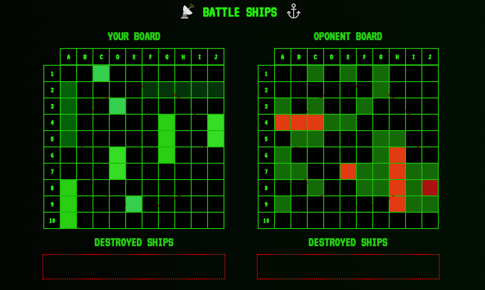
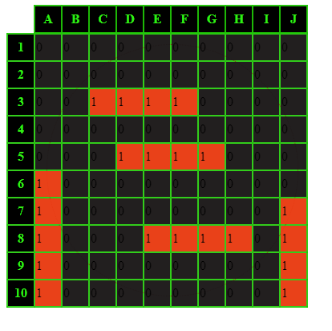

# Battle ships project (under constuction) 🚧⚓
## Ship's Log, Day Two:
My professional work related to creating simple games has yielded interesting results: I find it very easy to navigate within the project's objectives, and I excel at translating mechanics into code. In fact, I already have a clear plan for the specific functions I will need and their structures, but I need time to translate this into actual code. I've completed everything I planned for today and even a bit more. So, we now have two separate retro-style boards with no explicit information displayed. The click events already handle basic states, but this functionality requires some extensive conditions - I won't have much time tomorrow, and I'm not sure if I'll be able to implement it. I also make an effort to clean up the "Board" component as I go, and I extract all finished and extended functions into separate files. Our ships have finally received global styles, and there's also a GameField component that will manage turns - but that will come later. The matrix color scheme is working wonderfully, complemented by a retro-pixelated font from the monospace family. And finally, the project continues to bring me a lot of joy - I have so many ideas. I even thought about implementing "Ships 2.0" where instead of firing a shot, you can move the ship! However, initially, I was concerned about the gameplay according to my plans potentially lasting for hours (I assumed that ships could move to any square, even if it had already been checked by the opponent). Secondly, there are defined time and task constraints. Lastly, when you have only two points, don't make a list out of them. 😅

## Ship's Log, Day One:
I have created the foundations for a battleship game in a React + TypeScript + Styled Components environment, along with a basic "board" component that will serve as the basis for all testing. I have thought through the game's principles; for now, both the player's and opponent's ships will appear randomly. If I have enough time, I will add the ability to manipulate the ship positions. I have also created scripts to generate the largest ships in such a way that they do not neighbor any other ships. In the next session, I will edit this function to create any type of vessels. For a better reception, I added simple retro-style styling; the color scheme had to evoke sonar imagery, so it's no surprise that I chose black and green. I also added a simple sonar animation - a left-visible circle that expands across the entire board every 3 seconds. When I move on to full styling, I will adjust its appearance so that it does not distract during gameplay. For now, when the animation was more visible, it only made navigation on the board more difficult, and it should be a pleasant addition, not a distraction. So far, I'm having a great time - I learned a new CSS property: pointer-events: none; - I've never dealt with it before, and it solved the sonar problem. This is going to be a real adventure; I just hope I have enough time because my goals are quite ambitious.

# Getting Started with Create React App

This project was bootstrapped with [Create React App](https://github.com/facebook/create-react-app).

## Available Scripts

In the project directory, you can run:

### `npm start`

Runs the app in the development mode.\
Open [http://localhost:3000](http://localhost:3000) to view it in the browser.

The page will reload if you make edits.\
You will also see any lint errors in the console.

### `npm test`

Launches the test runner in the interactive watch mode.\
See the section about [running tests](https://facebook.github.io/create-react-app/docs/running-tests) for more information.

### `npm run build`

Builds the app for production to the `build` folder.\
It correctly bundles React in production mode and optimizes the build for the best performance.

The build is minified and the filenames include the hashes.\
Your app is ready to be deployed!

See the section about [deployment](https://facebook.github.io/create-react-app/docs/deployment) for more information.

### `npm run eject`

**Note: this is a one-way operation. Once you `eject`, you can’t go back!**

If you aren’t satisfied with the build tool and configuration choices, you can `eject` at any time. This command will remove the single build dependency from your project.

Instead, it will copy all the configuration files and the transitive dependencies (webpack, Babel, ESLint, etc) right into your project so you have full control over them. All of the commands except `eject` will still work, but they will point to the copied scripts so you can tweak them. At this point you’re on your own.

You don’t have to ever use `eject`. The curated feature set is suitable for small and middle deployments, and you shouldn’t feel obligated to use this feature. However we understand that this tool wouldn’t be useful if you couldn’t customize it when you are ready for it.

## Learn More

You can learn more in the [Create React App documentation](https://facebook.github.io/create-react-app/docs/getting-started).

To learn React, check out the [React documentation](https://reactjs.org/).
