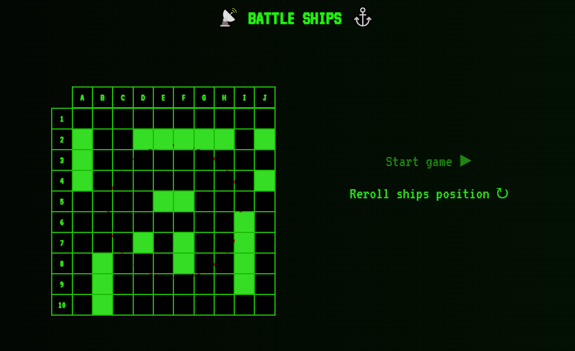
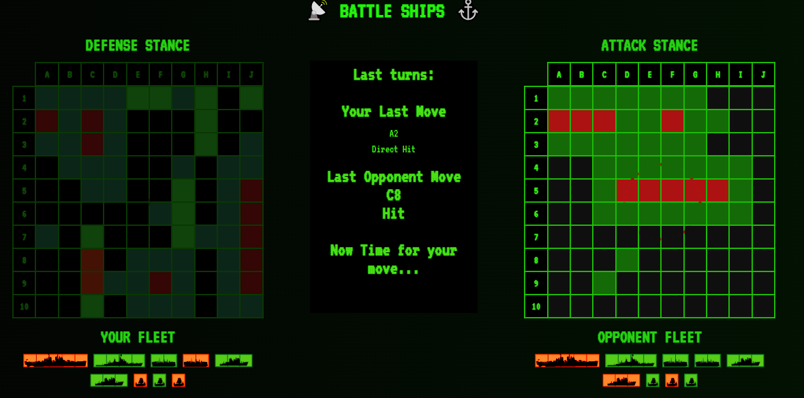
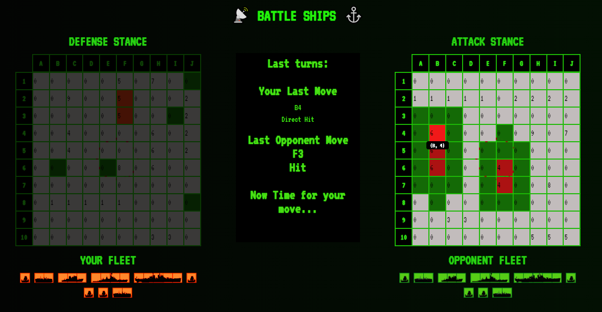
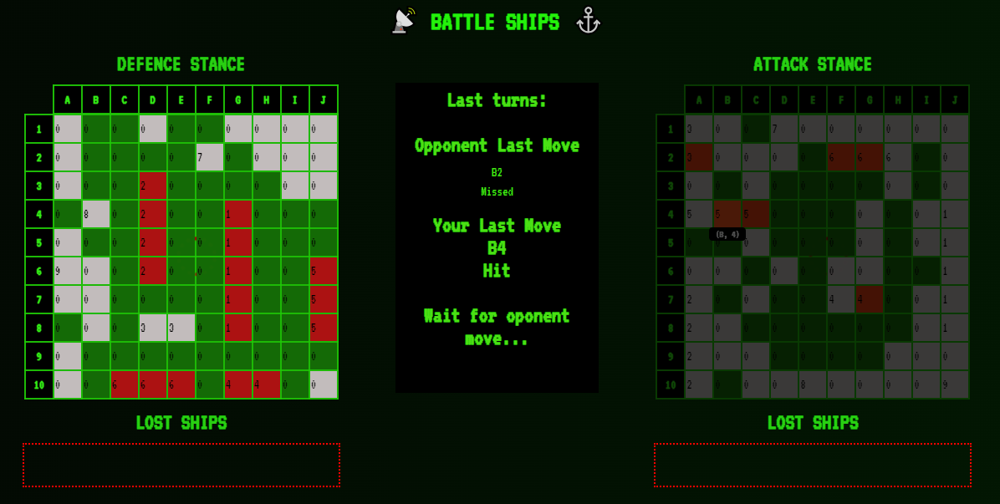
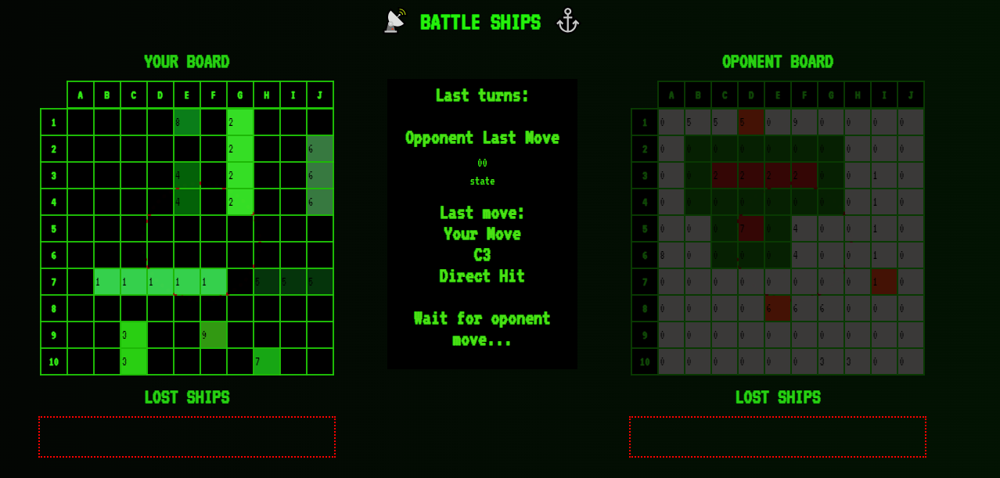
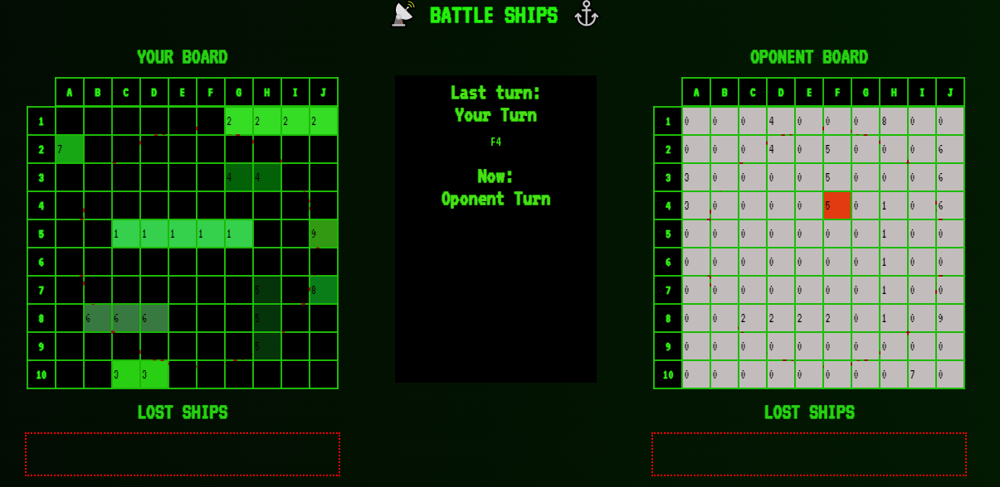
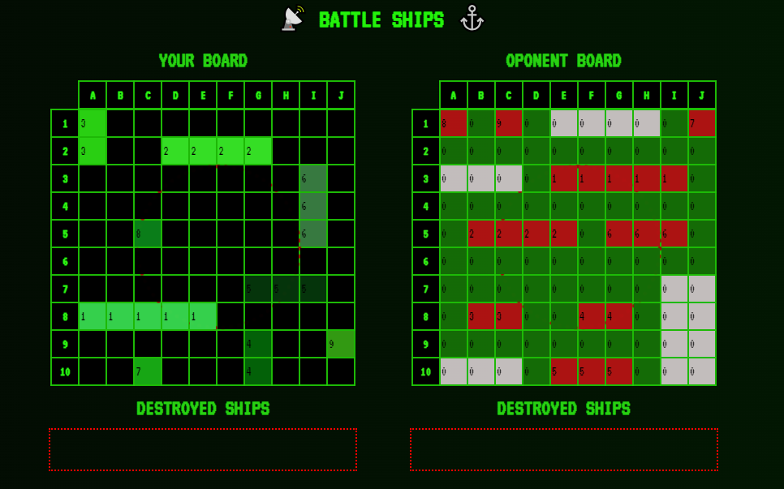
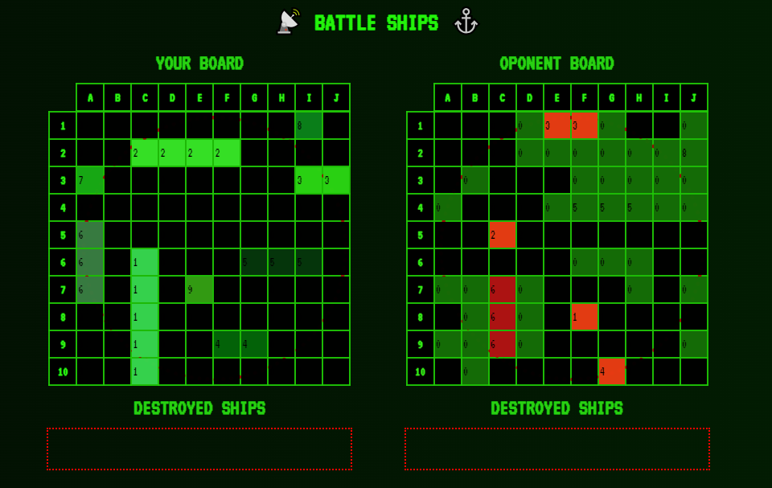

# Battle ships project (under constuction) 🚧⚓

## Ship's log, Day Nine:
Yesterday, I had a break, and today when I returned to the code, connecting the active ship images that represent the board situation went smoothly. I also added a simple initial interface with the option to randomly relocate ships. I know it would be great to add manual placement with drag and drop, but unfortunately, I'm aware I don't have enough time for that. I've also started working on the rudimentary end screen, which will provide a basic summary: you won/lost. I would love to add a time skip feature for the entire gameplay, but it would require recording each move, and I won't have time for that either. As for ambitious ideas, it would be nice to save the current game state in local storage, and I might even add that. However, my main goal is to deliver a fully playable and optimized application, so I'm focusing entirely on that. Today, the original colors returned to the game, and I won't need previews of the value and state anymore. I did a lot of enjoyable visual work today, and the project is heading towards completion. Regardless of the results, I will continue working until I achieve satisfactory results.

## Ship's log, day Eight:
I created ship graphics and added an array to hold their states. I've already thought through the whole function, but ran out of time to implement it. Tomorrow is a break, so I probably won't be able to add anything. I moved some of the gameField elements to the board to avoid code duplication and to have two nearly identical elements that differ mainly in the opponentBoard argument.

## Ship's log, Day Seven:
Today, the most crucial optimization decisions were made so far. I refactored the code segment responsible for checking the designated square, and I abandoned the prototype of random moves in favor of a much more efficient array of available moves. This array iterates through the board, checking if any ship has already been hit and adding the next possible moves. I managed to fit this into a single full board iteration, and I'm satisfied with the performance. The previous solution theoretically could have led to an infinite loop of random moves, never selecting the one move that remained. Here, the solution is essentially straightforward and works like a player's mind choosing a move from the available options rather than first thinking about a random move and then checking if it can actually be executed 🤯 As for the visual layer, nothing has changed today. The next task is the graphical representation of lost units and an initial interface. Unfortunately, I don't have much time available again over the weekend, which is a pity because this task has incredibly captivated me.

## Ship's log, Day Six:
Today, I had only a few moments, but I managed to cross off quite a few tasks from the list. I completed the turn-based system with a graphical effect that clearly indicates whose turn it is. I also finished the central board with information about recent turns. I'll refine the text to make the message clear, but that's a job for the scriptwriting phase 😉. The next task is quite challenging - I'm planning an enemy movement algorithm. The concept of conditions is actually straightforward and ready; it's just a matter of finding the time to sit down and write it out 🙄.

## Ship's log, Day Five:
Minimal progress is still progress 😅 as always, battling against time, but systematic work allows us to move the project forward in small steps. More tasks are being added to the completed list. Turn-based mechanics and a central board summarizing current game events and the previous turn have been created.

## Ship's log, Day Four:
Although I didn't manage to finish by midnight due to a chronic lack of time, fifteen minutes past, the `handleCellClick` function is ready - it changes the state of all cells with the same value, and additionally marks all cells around the destroyed ship as "missed." I am convinced that handling this click was the most complex task in the entire project - only deep work brought results, shorter sessions didn't yield such positive outcomes. After two days of fierce battle with functions, besides immense satisfaction, much more enjoyable tasks await me. I have the basic mechanics ready, except for turn-based gameplay and custom ship placements. I'm still having a great time, and visible progress only adds to my enthusiasm, making me want more - but how to conquer a day that can't be stretched ⏰😄.

## Ship's log, day three:
A total lack of time, but I managed to expand the function handling clicks. I still want to, after sinking the entire ship, automatically change the surrounding fields to a state that corresponds to "missed," and I'm very close to achieving that. Unfortunately, I didn't get much else done today, but I'm quite satisfied with my progress. For now, I'm focusing on getting the basic mechanics working, and I'll leave refactoring that specific function for when it's functional and can be moved to a separate file.

## Ship's Log, Day Two:
My professional work related to creating simple games has yielded interesting results: I find it very easy to navigate within the project's objectives, and I excel at translating mechanics into code. In fact, I already have a clear plan for the specific functions I will need and their structures, but I need time to translate this into actual code. I've completed everything I planned for today and even a bit more. So, we now have two separate retro-style boards with no explicit information displayed. The click events already handle basic states, but this functionality requires some extensive conditions - I won't have much time tomorrow, and I'm not sure if I'll be able to implement it. I also make an effort to clean up the "Board" component as I go, and I extract all finished and extended functions into separate files. Our ships have finally received global styles, and there's also a GameField component that will manage turns - but that will come later. The matrix color scheme is working wonderfully, complemented by a retro-pixelated font from the monospace family. And finally, the project continues to bring me a lot of joy - I have so many ideas. I even thought about implementing "Ships 2.0" where instead of firing a shot, you can move the ship! However, initially, I was concerned about the gameplay according to my plans potentially lasting for hours (I assumed that ships could move to any square, even if it had already been checked by the opponent). Secondly, there are defined time and task constraints. Lastly, when you have only two points, don't make a list out of them. 😅

## Ship's Log, Day One:
I have created the foundations for a battleship game in a React + TypeScript + Styled Components environment, along with a basic "board" component that will serve as the basis for all testing. I have thought through the game's principles; for now, both the player's and opponent's ships will appear randomly. If I have enough time, I will add the ability to manipulate the ship positions. I have also created scripts to generate the largest ships in such a way that they do not neighbor any other ships. In the next session, I will edit this function to create any type of vessels. For a better reception, I added simple retro-style styling; the color scheme had to evoke sonar imagery, so it's no surprise that I chose black and green. I also added a simple sonar animation - a left-visible circle that expands across the entire board every 3 seconds. When I move on to full styling, I will adjust its appearance so that it does not distract during gameplay. For now, when the animation was more visible, it only made navigation on the board more difficult, and it should be a pleasant addition, not a distraction. So far, I'm having a great time - I learned a new CSS property: pointer-events: none; - I've never dealt with it before, and it solved the sonar problem. This is going to be a real adventure; I just hope I have enough time because my goals are quite ambitious.

# Getting Started with Create React App

This project was bootstrapped with [Create React App](https://github.com/facebook/create-react-app).

## Available Scripts

In the project directory, you can run:

### `npm start`

Runs the app in the development mode.\
Open [http://localhost:3000](http://localhost:3000) to view it in the browser.

The page will reload if you make edits.\
You will also see any lint errors in the console.

### `npm test`

Launches the test runner in the interactive watch mode.\
See the section about [running tests](https://facebook.github.io/create-react-app/docs/running-tests) for more information.

### `npm run build`

Builds the app for production to the `build` folder.\
It correctly bundles React in production mode and optimizes the build for the best performance.

The build is minified and the filenames include the hashes.\
Your app is ready to be deployed!

See the section about [deployment](https://facebook.github.io/create-react-app/docs/deployment) for more information.

### `npm run eject`

**Note: this is a one-way operation. Once you `eject`, you can’t go back!**

If you aren’t satisfied with the build tool and configuration choices, you can `eject` at any time. This command will remove the single build dependency from your project.

Instead, it will copy all the configuration files and the transitive dependencies (webpack, Babel, ESLint, etc) right into your project so you have full control over them. All of the commands except `eject` will still work, but they will point to the copied scripts so you can tweak them. At this point you’re on your own.

You don’t have to ever use `eject`. The curated feature set is suitable for small and middle deployments, and you shouldn’t feel obligated to use this feature. However we understand that this tool wouldn’t be useful if you couldn’t customize it when you are ready for it.

## Learn More

You can learn more in the [Create React App documentation](https://facebook.github.io/create-react-app/docs/getting-started).

To learn React, check out the [React documentation](https://reactjs.org/).
